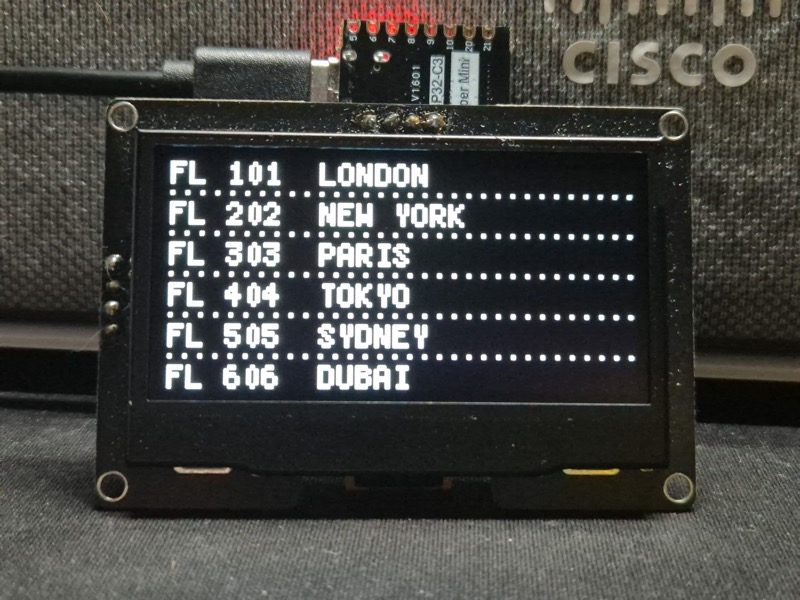
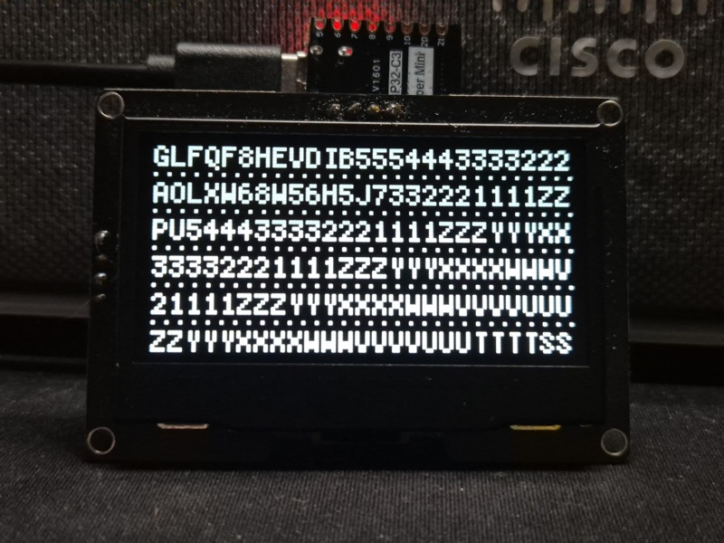
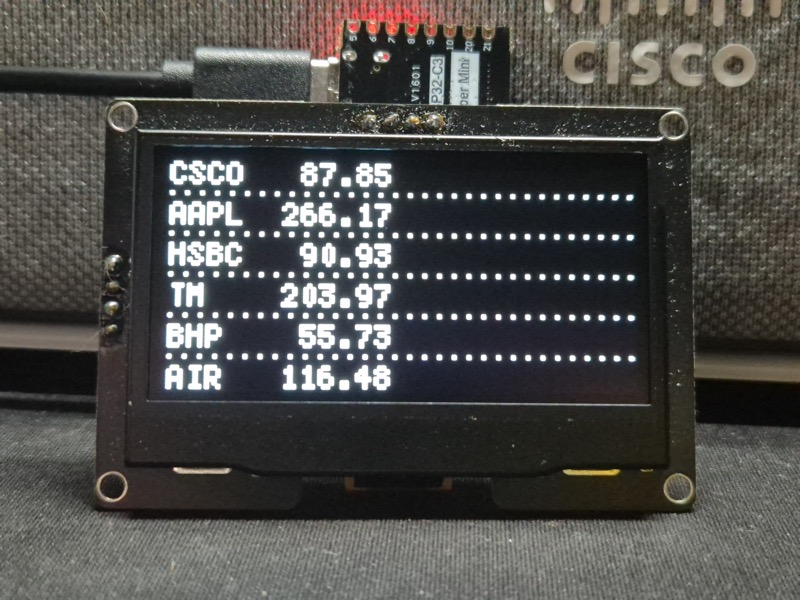
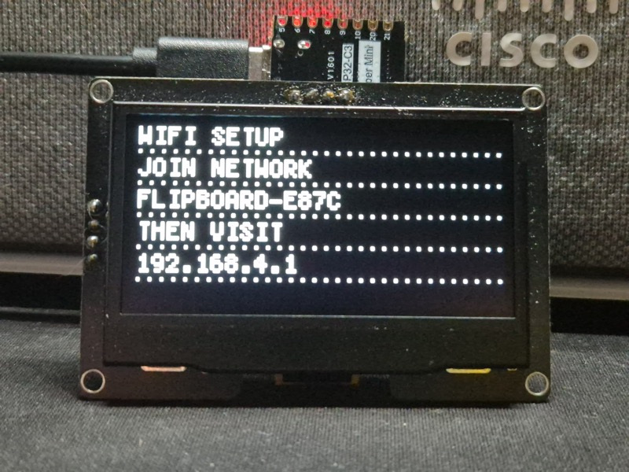
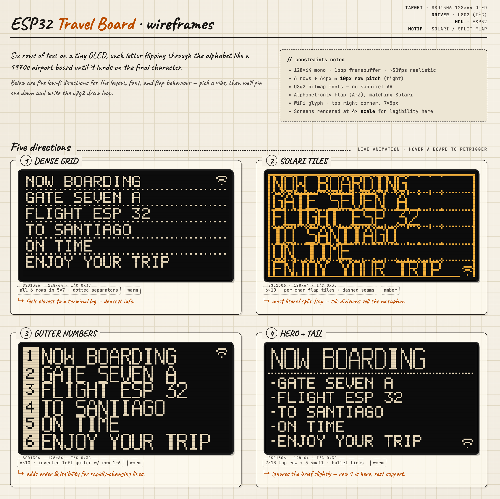

# FlipBoard

> This project was built as an experiment to see how effectively Claude could be used as the sole development tool for an embedded ESP32 project - from initial design spec through to a working networked device, with no code written by hand. Ok, some tweaking to fix visual errors where things did not line up pixel perfect.

FlipBoard is a split-flap departure board simulator for the ESP32, rendered on a 128×64 SSD1306 OLED. It recreates the look and feel of the mechanical Solari boards found in airports and train stations — each character slot cycles independently through the alphabet before locking onto its final glyph, with rows cascading one after another in the classic left-to-right, top-to-bottom sequence.

```
FL 101  LONDON
FL 202  NEW YORK
FL 303  PARIS
FL 404  TOKYO
FL 505  SYDNEY
FL 606  DUBAI
```

The display is divided into six fixed-width rows separated by dotted rules. A WiFi signal indicator sits in the top-right corner. Text on any row — or all rows at once — can be updated remotely over WiFi via a secured HTTP API, a built-in browser UI served directly from the device, a Socket.IO server for real-time push updates, or the included Bash shell script.

| Demo content | Mid-flip animation |
|:---:|:---:|
|  |  |

| Stock ticker content | WiFi setup screen |
|:---:|:---:|
|  |  |



---

## Design

The 128×64 pixel display is laid out with an 11-pixel row pitch: 6 pixels of glyph body, 2 pixels of clear space, a 1-pixel dotted separator, and 2 more pixels of clear space before the next row. This fills the display exactly across all six rows with a 2-pixel bottom margin. The font is `u8g2_font_5x7_tr` with a 6-pixel advance, giving up to 21 characters per row from a 2-pixel left margin to the right edge of the display.

The animation engine runs a `FlapSlot` state machine for every character position in the 6×25 grid. When a row is updated, each slot is assigned a flip count of at least one full alphabet lap (37 steps through `A–Z 0–9` plus space) plus the clockwise distance to the target character — so even a one-character change looks mechanically heavy. Slots within a row start 20 ms apart, and rows themselves start 120 ms apart, producing the characteristic cascade. The engine is fully non-blocking: `board_tick()` is called every `loop()` iteration with no `delay()` in the render path.

The Socket.IO client defers reconnection attempts until the animation has finished, and all network I/O is non-blocking so the display never stalls mid-flip.

WiFi credentials are never hardcoded. On first boot the device opens a captive-portal access point; once credentials are saved to NVS the portal never appears again. The HTTP server requires an API key on all write endpoints, enforces a 10 req/s global rate limit, and rejects bodies over 512 bytes.

---

## Features

### Display

- Split-flap animation with staggered cascade (left-to-right within a row, row 0 through row 5)
- 6 rows × 21 characters, alphabet `A–Z 0–9` plus `space - : / . !`
- Dotted separator rules between rows; WiFi signal icon top-right
- Adjustable brightness (0–100 %) applied immediately, survives dim/wake cycles

### Burn-in protection

| Idle time | Action |
|-----------|--------|
| 30 seconds | Contrast dimmed to ~10% |
| 10 minutes (default) | Display powered off (`setPowerSave`) |
| Any new data | Full brightness restored instantly |

The power-off timeout can be overridden at runtime via any interface. The override resets to 10 minutes on reboot.

### Wake sources

The display can be woken from dim or off state by any of:

- Incoming data on any API endpoint or Socket.IO event
- `POST /display/wake` or the **WAKE + REPLAY** button in the web UI
- A physical momentary button (active-low, internal pull-up, configurable GPIO)
- An mmWave presence sensor (LD2410 or similar, rising-edge trigger, configurable GPIO)
- The `wake` Socket.IO event from the server

On wake the current content is replayed through the full split-flap cascade animation.

### Demo mode

On each boot a random built-in preset is shown. Demo mode cycles through all presets in random order every 30 seconds. Sending real content via any interface cancels demo mode automatically.

Built-in preset categories: international flights, trains (SA, UK, Germany, Japan Shinkansen), stocks, crypto, space launches, world weather, world time zones (all major zones), F1 leaderboard, cinema listings, and humorous boards. Presets are defined in `src/presets.h` — add new ones freely without changing any other file.

---

## Hardware

| Component | Details |
|-----------|---------|
| MCU | ESP32-C3 DevKitM-1 |
| Display | SSD1306 OLED, 128×64 px, I²C |
| Interface | USB-C (native USB-CDC, no UART bridge needed) |
| Optional | Momentary push-button (any free GPIO → GND) |
| Optional | mmWave presence sensor e.g. LD2410 (OUT pin → any free GPIO) |

### Wiring

#### ESP32-C3 DevKitM-1

| OLED pin | ESP32-C3 pin |
|----------|-------------|
| VCC | 3V3 |
| GND | GND |
| SDA | GPIO3 |
| SCL | GPIO4 |

The I²C pins can be changed in `platformio.ini` without touching any source files.

---

## Prerequisites

- [VS Code](https://code.visualstudio.com/) with the [PlatformIO extension](https://platformio.org/install/ide?install=vscode)
- Or the [PlatformIO CLI](https://docs.platformio.org/en/latest/core/installation/) standalone
- Node.js 18+ (for the optional Socket.IO server)

---

## Setup

### 1. Clone the repository

```sh
git clone https://github.com/dodge107/ESP-terminal-log.git
cd flipboard
```

### 2. Create your secrets file

```sh
cp src/secrets.h.example src/secrets.h
```

`src/secrets.h` is listed in `.gitignore` and will never be committed.

### 3. Generate an API key

```sh
openssl rand -hex 16
```

Paste the output into `src/secrets.h`:

```cpp
#define API_KEY  "your-generated-key-here"
```

### 4. Build and flash

**VS Code:** Open the project folder, select the environment from the PlatformIO toolbar, and click Upload.

**CLI:**

```sh
pio run -e esp32-c3-devkitm-1 --target upload
```

### 5. Monitor serial output

```sh
pio device monitor -e esp32-c3-devkitm-1
```

Output is at 115200 baud. You will see boot stats, WiFi events, and a status block every 5 seconds.

### Boot status splash

Immediately after connecting to WiFi the board displays a 6-row status screen for 60 seconds so you can easily read the assigned IP without opening a serial monitor:

```
FLIPBOARD-3A4F
IP 192.168.1.42
MYNETWORK
RSSI -62 DBM
SIO CONNECTED
BRIGHTNESS 78
```

| Row | Content |
|-----|---------|
| 0 | Board hostname (`FLIPBOARD-XXXX`) |
| 1 | IP address |
| 2 | WiFi SSID |
| 3 | RSSI in dBm |
| 4 | Socket.IO state: `CONNECTED`, `CONNECTING`, or `DISABLED` |
| 5 | Current brightness % |

After 60 seconds the display transitions to a random preset with the normal cascade animation. The splash is cancelled immediately if any real content arrives via the API, Socket.IO, or demo mode.

```
── status ──────────────────────────
  WiFi      : MyNetwork
  IP        : 192.168.1.42
  RSSI      : -62 dBm (2 bars)
  Socket.IO : connected  192.168.1.10:3500
  Brightness: 78%
  LED 1     : pulse  100%  override=flash
  LED 2     : off    100%  override=off
  Heap free : 214320 bytes
  Heap min  : 201440 bytes
  Uptime    : 47 s
────────────────────────────────────
```

The Socket.IO line shows `connected`, `connecting`, or `disabled` along with the configured host and port. Brightness reflects the current user-set level. LED lines show mode, brightness percentage, and the current override mode.


---

## First-time WiFi setup

WiFi credentials are not hardcoded. On first boot the board opens a captive portal:

1. The display shows **WIFI SETUP** with the AP name (e.g. `FLIPBOARD-3A4F`).
2. Connect your phone or laptop to that access point.
3. A configuration page opens automatically, or browse to `192.168.4.1`.
4. Select your network, enter the password, and optionally configure the Socket.IO server.
5. Save — the board connects, stores credentials in NVS, and starts normally.

On every subsequent boot the saved credentials are used — no portal appears.

To switch networks, use the **Reset WiFi Settings** button in the web UI or call `POST /wifi/reset`.

---

## Web UI

Once connected, open `http://<board-ip>/` in any browser.

The UI has three tabs:

- **BOARD** — enter text for each row and click **Update Board**. Also contains the brightness slider, display-off timeout, wake button, demo mode toggle, and WiFi reset. The API key is saved to `localStorage` so you only enter it once per browser.
- **SETTINGS** — configure the Socket.IO remote server connection (host, port, enable/disable), and control the LED indicators (normal mode, brightness, override mode). Changes take effect immediately without rebooting.
- **API DOCS** — inline reference for all HTTP endpoints with curl examples.

The board's IP address is printed in the serial monitor after connecting and is also returned by `GET /status`.

---

## REST API

All endpoints except `GET /` require the header `X-Api-Key: <your-key>`.

```sh
KEY="your-api-key-here"
IP="192.168.1.42"
```

| Method | Path | Description |
|--------|------|-------------|
| `GET` | `/` | Web UI (no auth required) |
| `GET` | `/status` | WiFi state, memory, brightness as JSON |
| `POST` | `/row/<0-5>` | Set one row |
| `POST` | `/rows` | Set all 6 rows (newline-delimited body) |
| `DELETE` | `/row/<0-5>/clear` | Blank a row |
| `POST` | `/display/brightness` | Set brightness 0–100 (plain text body) |
| `POST` | `/display/wake` | Wake display and replay current content |
| `POST` | `/display/demo` | Start or stop demo mode (`on` / `off`) |
| `POST` | `/display/timeout` | Set idle power-off timeout (minutes, 0 = never) |
| `GET` | `/config/sio` | Read current Socket.IO config and connection state |
| `POST` | `/config/sio` | Update Socket.IO config and reconnect immediately |
| `GET` | `/led/status` | LED state for both indicators as JSON |
| `POST` | `/led/<1\|2>/mode` | Set LED normal mode (`on`, `off`, `flash`, `pulse`) |
| `POST` | `/led/<1\|2>/brightness` | Set LED brightness 0–100 |
| `POST` | `/led/<1\|2>/override` | Set LED override mode — activates on new content when unwatched |
| `POST` | `/wifi/reset` | Clear WiFi credentials and reboot |

### Examples

```sh
# Set a single row
curl -X POST http://$IP/row/0 \
     -H "X-Api-Key: $KEY" \
     -H "Content-Type: text/plain" \
     -d "GATE CHANGE B12"

# Set all rows at once
curl -X POST http://$IP/rows \
     -H "X-Api-Key: $KEY" \
     -H "Content-Type: text/plain" \
     -d $'FL 101  LONDON\nFL 202  NEW YORK\nFL 303  PARIS\nFL 404  TOKYO\nFL 505  SYDNEY\nFL 606  DUBAI'

# Set brightness to 60%
curl -X POST http://$IP/display/brightness \
     -H "X-Api-Key: $KEY" \
     -H "Content-Type: text/plain" \
     -d "60"

# Start demo mode
curl -X POST http://$IP/display/demo \
     -H "X-Api-Key: $KEY" \
     -H "Content-Type: text/plain" \
     -d "on"

# Wake the display and replay content
curl -X POST http://$IP/display/wake -H "X-Api-Key: $KEY"

# Set display timeout to 30 minutes
curl -X POST http://$IP/display/timeout \
     -H "X-Api-Key: $KEY" \
     -H "Content-Type: text/plain" \
     -d "30"

# Disable power-off entirely
curl -X POST http://$IP/display/timeout \
     -H "X-Api-Key: $KEY" \
     -H "Content-Type: text/plain" \
     -d "0"

# Configure Socket.IO server
curl -X POST http://$IP/config/sio \
     -H "X-Api-Key: $KEY" \
     -H "Content-Type: application/json" \
     -d '{"enabled":true,"host":"192.168.1.10","port":3500}'

# Get status (includes brightness field)
curl http://$IP/status -H "X-Api-Key: $KEY"

# Clear row 3
curl -X DELETE http://$IP/row/3/clear -H "X-Api-Key: $KEY"
```

The display accepts `A–Z`, `0–9`, and `space - : / . !`. Lowercase is uppercased automatically; unsupported characters are stripped.

### Status response

```json
{
  "wifi":      "MyNetwork",
  "ip":        "192.168.1.42",
  "rssi":      -62,
  "bars":      2,
  "free_heap": 214320,
  "min_heap":  201440,
  "uptime_s":  47,
  "brightness": 78,
  "led1": { "mode": "pulse", "brightness": 100, "override": "flash" },
  "led2": { "mode": "off",   "brightness": 100, "override": "off"  }
}
```

---

## LED indicators

Up to two PWM indicator LEDs can be wired to any free GPIO pins. Each LED is independently controlled with four modes, adjustable brightness, and an optional notification behaviour.

### Wiring

Connect each LED's anode through a current-limiting resistor (~220 Ω) to the GPIO, and the cathode to GND. The LEDC peripheral drives the pin at 5 kHz, 8-bit resolution.

Enable in `platformio.ini`:

```ini
build_flags =
    ${env.build_flags}
    -DI2C_SDA_PIN=3
    -DI2C_SCL_PIN=4
    -DLED1_PIN=10
    -DLED2_PIN=11
```

Either pin is optional — define only one if you have a single LED.

### Modes

| Mode | Behaviour |
|------|-----------|
| `off` | Always off |
| `on` | Always on at set brightness |
| `flash` | 500 ms on / 500 ms off |
| `pulse` | Sine-wave breathing over a 3-second cycle |

### Override mode

Each LED has a **normal mode** and an **override mode**. The override mode is the mode the LED switches to when new content arrives and nobody is present — it is an indefinite attention signal, not a timed flash.

| Event | LED behaviour |
|-------|--------------|
| New content arrives (HTTP or Socket.IO) | Switches to override mode (if override ≠ normal) |
| Wake event — button press, radar, `POST /display/wake`, or SIO `wake` | Returns to normal mode |

The override mode must differ from the normal mode — setting them the same is rejected with a `400` error. The board and server UIs enforce this by disabling the matching option in the override selector. Settings are persisted to NVS and survive reboots.

**Example:** LED is set to `on` (always lit) with override `flash`. While the display is unattended, new content arrives — the LED starts flashing to attract attention. When someone presses the button or walks past the radar, the display wakes and the LED returns to steady `on`.

### Interfaces

| Interface | How |
|-----------|-----|
| Web UI | LED section on the SETTINGS tab — mode buttons, brightness slider, override mode dropdown |
| HTTP API | `POST /led/<1\|2>/mode`, `POST /led/<1\|2>/brightness`, `POST /led/<1\|2>/override` |
| Shell script | `led`, `led-bright`, `led-override` commands; `l`, `L`, `o` menu options |
| Socket.IO | `led_mode`, `led_brightness`, and `led_override` events from the server |
| Server dashboard | Mode buttons, brightness sliders, and override dropdowns for each LED |

### HTTP examples

```sh
# Set LED 1 to pulse mode
curl -X POST http://$IP/led/1/mode \
     -H "X-Api-Key: $KEY" \
     -H "Content-Type: text/plain" \
     -d "pulse"

# Set LED 2 brightness to 60%
curl -X POST http://$IP/led/2/brightness \
     -H "X-Api-Key: $KEY" \
     -H "Content-Type: text/plain" \
     -d "60"

# Set LED 1 override to flash (attracts attention when new content arrives unattended)
curl -X POST http://$IP/led/1/override \
     -H "X-Api-Key: $KEY" \
     -H "Content-Type: text/plain" \
     -d "flash"

# Get LED status
curl http://$IP/led/status -H "X-Api-Key: $KEY"
```

LED status response:
```json
{
  "led1": { "mode": "on",  "brightness": 100, "override": "flash" },
  "led2": { "mode": "off", "brightness": 100, "override": "off"   }
}
```

### Shell script examples

```sh
./scripts/flipboard.sh led 1 on
./scripts/flipboard.sh led-override 1 flash
./scripts/flipboard.sh led-bright 1 80
./scripts/flipboard.sh led 2 pulse
./scripts/flipboard.sh led-override 2 off
```

---

## Brightness

Brightness is set as a percentage (0–100) and applied immediately to the OLED contrast register. The value persists through dim/wake cycles — waking the display always restores the user-set level, not a hardcoded default. It resets to ~78% on reboot.

| Interface | How |
|-----------|-----|
| Web UI | Brightness slider on the BOARD tab |
| HTTP API | `POST /display/brightness` with plain text body `0`–`100` |
| Shell script | `./flipboard.sh brightness [0-100]` or menu option `b` |
| Socket.IO | `brightness` event `{ percent: N }` from the server |
| Server dashboard | Brightness slider on the server web UI |

---

## Socket.IO live updates

The board can connect to a Socket.IO server for real-time push updates — no polling, near-instant delivery. This uses plain `ws://` (no TLS), so the server needs to be on your local network or a host that does not force HTTPS.

The WebSocket client is implemented directly over `WiFiClient` (no external library). The client is fully non-blocking — reconnection is deferred until the current animation finishes, so a server reconnect never stalls a mid-flip display.

### Configure via the web UI

Open the **SETTINGS** tab in the web UI, fill in the server details, and click **SAVE + CONNECT**. The board reconnects immediately and the status indicator updates within a few seconds. Settings are persisted to NVS and survive reboots.

### Configure via the WiFi portal

Socket.IO can also be configured during first-time WiFi setup. The captive portal shows three extra fields at the bottom of the WiFi form:

| Field | Example | Notes |
|-------|---------|-------|
| Socket.IO enable | `yes` | `yes` / `no` |
| Socket.IO server host/IP | `192.168.1.10` | IP or hostname, no `http://` |
| Socket.IO port | `3500` | Default 3000 |

### Configure via the API

```sh
curl -X POST http://$IP/config/sio \
     -H "X-Api-Key: $KEY" \
     -H "Content-Type: application/json" \
     -d '{"enabled":true,"host":"192.168.1.10","port":3500}'
```

### Run the server

```sh
cd server
npm install
node server.js
```

Open `http://localhost:3500` for the dashboard. The server also exposes a REST API:

```sh
# Set all rows
curl -X POST http://localhost:3500/api/rows \
     -H "X-Api-Key: $KEY" \
     -H "Content-Type: application/json" \
     -d '{"rows":["FL 101  LONDON","FL 202  NEW YORK","","","",""]}'

# Set one row
curl -X POST http://localhost:3500/api/row \
     -H "X-Api-Key: $KEY" \
     -H "Content-Type: application/json" \
     -d '{"row":0,"text":"GATE CHANGE B12"}'

# Set brightness
curl -X POST http://localhost:3500/api/brightness \
     -H "X-Api-Key: $KEY" \
     -H "Content-Type: application/json" \
     -d '{"percent":60}'

# Wake display
curl -X POST http://localhost:3500/api/wake \
     -H "X-Api-Key: $KEY"

# Demo mode
curl -X POST http://localhost:3500/api/demo \
     -H "X-Api-Key: $KEY" \
     -H "Content-Type: application/json" \
     -d '{"mode":"on"}'

# Set timeout
curl -X POST http://localhost:3500/api/timeout \
     -H "X-Api-Key: $KEY" \
     -H "Content-Type: application/json" \
     -d '{"minutes":30}'
```

### Multi-tenant server

The server supports multiple independent operators. Each board authenticates with its API key after connecting and is placed into an isolated room. Broadcasts only reach boards that share the same key.

The dashboard stores the key in `localStorage`. All REST calls include `X-Api-Key` — you only see and control boards that belong to your key.

### Supported Socket.IO events (server → board)

| Event | Payload | Effect |
|-------|---------|--------|
| `set_row` | `{ row, text }` | Set one row |
| `set_all` | `{ rows: [...] }` | Set all 6 rows |
| `clear_row` | `{ row }` | Blank a row |
| `wake` | `{}` | Wake display + replay animation |
| `demo` | `{ mode: "on"\|"off" }` | Toggle demo mode |
| `timeout` | `{ minutes }` | Set idle power-off timeout |
| `brightness` | `{ percent }` | Set brightness 0–100 |
| `led_mode` | `{ led: 1\|2, mode }` | Set LED normal mode: `on`, `off`, `flash`, `pulse` |
| `led_brightness` | `{ led: 1\|2, percent }` | Set LED brightness 0–100 |
| `led_override` | `{ led: 1\|2, mode }` | Set LED override mode (must differ from normal mode) |

---

## Wake sources

### API / web UI

`POST /display/wake` restores full brightness and replays the current board content through the split-flap animation. A **WAKE + REPLAY** button is also available in the web UI BOARD tab.

```sh
curl -X POST http://$IP/display/wake -H "X-Api-Key: $KEY"
./scripts/flipboard.sh wake
```

### Socket.IO

The `wake` event from the Socket.IO server has the same effect as the HTTP endpoint.

### Button

Wire a momentary push-button between a free GPIO and GND. The pin is configured with an internal pull-up so no external resistor is needed. A 50 ms software debounce is applied.

| Button pin | ESP32-C3 pin |
|-----------|-------------|
| One leg | GPIO5 |
| Other leg | GND |

Enable in `platformio.ini`:

```ini
build_flags =
    ${env.build_flags}
    -DI2C_SDA_PIN=3
    -DI2C_SCL_PIN=4
    -DWAKE_BTN_PIN=5
```

### mmWave radar (e.g. LD2410)

Connect the sensor's OUT / presence pin to a free GPIO. The pin goes HIGH when presence is detected; the display wakes on the rising edge (first detection) and will not re-trigger while presence is held.

| Sensor pin | ESP32 pin |
|-----------|-----------|
| VCC | 3V3 |
| GND | GND |
| OUT | GPIO6 (or any free GPIO) |

Enable in `platformio.ini`:

```ini
build_flags =
    ${env.build_flags}
    -DI2C_SDA_PIN=3
    -DI2C_SCL_PIN=4
    -DWAKE_RADAR_PIN=6
```

Both hardware sources can be enabled simultaneously by including both flags.

---

## Shell script

`scripts/flipboard.sh` is a Bash CLI for controlling the board from any Linux or macOS terminal. It requires `curl` and Bash 3.2 or later (compatible with macOS default shell — no external dependencies).

### Setup

```sh
chmod +x scripts/flipboard.sh

# First run — save your board IP and API key
./scripts/flipboard.sh configure
```

Credentials are saved to `~/.flipboard_config` (mode 600) and reused on every subsequent call. You can also override them per-invocation with environment variables:

```sh
BOARD_IP_OVERRIDE=192.168.1.42 API_KEY_OVERRIDE=yourkey ./scripts/flipboard.sh status
```

### Commands

| Command | Description |
|---------|-------------|
| `configure` | Save board IP and API key |
| `status` | Print board status JSON (includes brightness) |
| `row <0-5> [text]` | Set a single row |
| `rows` | Set all 6 rows interactively |
| `clear <0-5>` | Animate a row to blank |
| `clear-all` | Blank every row |
| `preset` | Load a built-in preset (flight board, stock ticker, custom) |
| `demo [on\|off]` | Start or stop cycling presets every 30 s |
| `wake` | Wake display and replay current content |
| `timeout [minutes]` | Override display off timeout; `0` = never power off |
| `brightness [0-100]` | Set display brightness percentage |
| `led <1\|2> [mode]` | Set LED mode: `on`, `off`, `flash`, `pulse` |
| `led-bright <1\|2> [%]` | Set LED brightness 0–100 |
| `led-override <1\|2> [mode]` | Set LED override mode: `on`, `off`, `flash`, `pulse` |
| `wifi-reset` | Erase saved WiFi credentials and reboot |
| *(no command)* | Launch the interactive menu |

### Examples

```sh
# Set a single row directly
./scripts/flipboard.sh row 0 "GATE CHANGE B12"

# Set brightness to 50%
./scripts/flipboard.sh brightness 50

# Start demo mode
./scripts/flipboard.sh demo on

# Wake the display
./scripts/flipboard.sh wake

# Keep the display on all night (0 = never off)
./scripts/flipboard.sh timeout 0

# Check WiFi and memory
./scripts/flipboard.sh status

# Launch the interactive menu
./scripts/flipboard.sh
```

### Interactive menu

Running the script with no arguments opens a numbered menu:

```
FlipBoard Controller  (192.168.1.42)
  1) Set one row
  2) Set all rows
  3) Clear one row
  4) Clear all rows
  5) Load a preset
  6) Get board status
  7) Demo mode on/off
  8) Wake display
  9) Set display off timeout
  b) Set brightness
  0) Configure (IP / API key)
  r) Reset WiFi
  q) Quit
```

---

## Changing I²C pins

Edit `platformio.ini` — no source changes needed:

```ini
[env:esp32-c3-devkitm-1]
build_flags =
    ${env.build_flags}
    -DI2C_SDA_PIN=3
    -DI2C_SCL_PIN=4
```

---

## Project structure

```
src/
  main.cpp          - WiFi, HTTP server, route handlers, web UI HTML
  travel_board.cpp  - Display driver, split-flap animation engine
  travel_board.h    - Public board API
  sio_client.cpp    - Socket.IO / WebSocket client (ws:// only, no library)
  sio_client.h      - Socket.IO client public API
  led_indicator.cpp - PWM LED driver (off/on/flash/pulse, override mode)
  led_indicator.h   - LED public API
  presets.h         - All demo presets (add new ones here freely)
  secrets.h         - API key (gitignored, create from secrets.h.example)
  secrets.h.example - Template to copy and fill in
server/
  server.js         - Node.js + Socket.IO server with web dashboard (multi-tenant)
  package.json      - Server dependencies (express, socket.io)
scripts/
  flipboard.sh      - Bash CLI for controlling the board
platformio.ini      - Build environment for ESP32-C3
```

---

## Security

### What is implemented

| Measure | Detail |
|---------|--------|
| API key authentication | All write endpoints require `X-Api-Key`. Missing or wrong key returns `401`. |
| Credentials out of source control | `secrets.h` is gitignored. WiFi credentials stored in device NVS, never in code. |
| Global rate limiting | Max 10 requests per second. Excess returns `429`. |
| Body size limit | Requests over 512 bytes are rejected with `413`. |
| Config file permissions | `~/.flipboard_config` written with mode `600` (owner read/write only). |
| WiFiManager portal timeout | Setup AP closes and board reboots after 3 minutes if unconfigured. |
| Multi-tenant isolation on server | Each API key gets its own Socket.IO room; boards cannot receive events from other keys. |
| Socket.IO animation-aware reconnect | Reconnection deferred until the current animation finishes — network I/O cannot block the display mid-flip. |
| Non-blocking network client | WebSocket handshake accumulated across loop() ticks; no `delay()` in the network path. |

### Known risks and missing mitigations

**No HTTPS / TLS**
All traffic is plain HTTP on port 80 and plain WebSocket (`ws://`). The API key, row content, and Socket.IO events are transmitted in cleartext and visible to anyone on the same network segment with a packet capture tool. The ESP32 Arduino stack does support `WiFiClientSecure` and `WebServerSecure`, but TLS requires a certificate, adds significant flash and RAM overhead, and is not implemented here.

*Practical mitigations short of full TLS:*
- Place the board on a dedicated IoT VLAN or trusted LAN with no untrusted devices.
- Use a reverse proxy (nginx, Caddy) on a local server to terminate TLS and forward to the board over the LAN.
- Do not expose port 80 or the Socket.IO server port to the internet.

**API key in cleartext**
Because there is no TLS, the API key is visible in every request. Anyone who captures one packet has the key permanently. Key rotation requires reflashing firmware (the device side) or updating the server config. There is no key expiry or revocation mechanism.

**Global rate limit only**
The 10 req/s limit is global across all clients. A single aggressive client can exhaust the allowance and deny access to others. Per-IP rate limiting would require dynamic allocation that is awkward on this constrained stack.

**WiFiManager portal is open**
During the 3-minute setup window the `FLIPBOARD-XXXX` AP has no WPA2 password. Anyone physically nearby can connect and submit credentials. This is a deliberate usability trade-off in the WiFiManager library.

**API key in plaintext flash**
The compiled key sits in the ESP32's flash. Anyone with physical access and `esptool.py read_flash` can extract it. ESP32 supports encrypted flash via eFuse-based flash encryption, but it is not enabled here — enabling it requires care to avoid permanently bricking the device.

**No CSRF protection on the web UI**
The browser UI submits to the device via JavaScript `fetch()`. A malicious page in another browser tab could make the same requests if it knows the board IP and API key (which is stored in `localStorage`). No CSRF tokens are implemented. The risk is low because the page is served from the device itself with no third-party scripts.

**`localStorage` key storage**
The API key is persisted to `localStorage` for convenience. Any JavaScript on the same origin can read it. Since the page has no CDN or third-party scripts the exposure is minimal — but it is not a hardened credential store.

**No authentication on `GET /`**
The web UI loads without a key so it is accessible to any browser on the network. Write operations still require the key.

**No network-level access control**
The HTTP server listens on all interfaces on port 80. There is no IP allowlist, firewall rule, or VPN requirement. Anyone reachable on the same network can attempt requests.

**Socket.IO server has no rate limiting**
The Node.js server forwards events to boards without any per-client throttle. A client with a valid API key can flood the board at whatever rate the server allows. Consider adding express-rate-limit if the server is exposed beyond a trusted LAN.

### Recommended deployment posture

- Place the board on a dedicated IoT VLAN with no internet access and no cross-VLAN routing to untrusted devices.
- Run the Socket.IO server only on the local LAN or behind a VPN.
- Treat the API key as a low-value shared secret — sufficient to prevent casual interference, not sufficient to protect sensitive data.
- Do not expose port 80 or 3500 directly to the internet.
- Rotate the API key by updating `src/secrets.h` and reflashing if you suspect it has been captured.
